# CLI Architecture

doklab's code is organized into distinct layers with clear responsibilities.

import { Callout } from 'nextra/components'

## Layer Diagram

```mermaid
flowchart TB
    subgraph CLI["CLI Layer (internal/cli/ + internal/client/)"]
        UP["up.go"]
        SHOW["show.go"]
        SYNC["sync.go"]
        BACKUP["backup.go"]
        INFRA["infra.go"]
        CLIENT["client.go<br/>gRPC client"]
    end

    subgraph Daemon["Daemon Layer (internal/daemon/)"]
        DAEMONSVC["daemon.go<br/>kardianos/service"]
        DAEMONGRPC["server.go<br/>gRPC API"]
    end

    subgraph App["App Layer (internal/app/)"]
        RESOLVE["resolve.go<br/>Config → State"]
        COMPOSE["compose.go<br/>Project Processing"]
        ROUTES["routes.go<br/>Route Reconciliation"]
        INFRAAPP["infra.go<br/>Stack Setup"]
        SYNCAPP["sync.go<br/>Sync Daemon Loop"]
    end

    subgraph Libs["Library Layer"]
        CONFIG["config/"]
        LABELS["labels/"]
        DOCKER["docker/"]
        VALS["vals/"]
        GIT["git/"]
    end

    subgraph External["External Systems"]
        DOCKERENG[["Docker Engine"]]
        GITREMOTE[["Git Remotes"]]
        TRAEFIK[["Traefik/TSDProxy"]]
        KOPIA[["Kopia"]]
    end

    CLI -->|gRPC| Daemon
    Daemon --> App
    App --> Libs
    Libs --> External
```



## Layer Responsibilities

### CLI Layer (`internal/cli/`)

The CLI layer connects to the daemon via gRPC:

- **up.go**: Deploy projects
- **show.go**: Display project information
- **sync.go**: GitOps synchronization
- **backup.go**: Backup management
- **infra.go**: Infrastructure stack commands
- **daemon.go**: Daemon management

```go
// Example: CLI command delegates to daemon via gRPC
func runUp(cmd *cobra.Command, args []string) error {
    c, err := client.New()  // Connect to daemon socket
    if err != nil {
        return err
    }
    defer c.Close()

    // Pass environment for external tools (vals, git, kopia)
    return c.Deploy(ctx, args[0], os.Environ())
}
```

### Daemon Layer (`internal/daemon/`)

Manages the background service and gRPC API:

- **Service lifecycle**: install, start, stop via kardianos/service
- **gRPC server**: All CLI commands route through Unix socket
- **Environment passing**: CLI passes env per-request for external tools
- **systemd/launchd integration**: Runs as user service

```go
// gRPC server handles CLI requests
func (s *server) Deploy(req *apiv1.DeployRequest, stream apiv1.Doklab_DeployServer) error {
    // Receives environment from CLI for vals, git, kopia
    env := mapToEnv(req.Env)

    // Delegates to App layer
    result, err := app.DeployProjectFromState(ctx, state, req.Project, env)
    if err != nil {
        return err
    }

    return stream.Send(&apiv1.Progress{Done: true})
}
```

### App Layer (`internal/app/`)

Core business logic and orchestration:

| File | Responsibility |
|------|----------------|
| `resolve.go` | Config → State transformation |
| `compose.go` | Project processing and deployment |
| `routes.go` | Route reconciliation with providers |
| `infra.go` | Infrastructure stack setup |
| `sync.go` | GitOps polling loop |

```go
// App layer orchestrates multiple libraries
func Up(cfg *config.Config, projectName string) error {
    state, _ := config.LoadState()
    project := state.Projects[projectName]

    // 1. Load and merge compose files
    compose := docker.LoadCompose(project)

    // 2. Parse and expand labels
    parsed := labels.Parse(compose)
    expanded := labels.Expand(parsed, cfg)

    // 3. Resolve secrets
    vals.ResolveSecrets(expanded)

    // 4. Deploy
    return docker.Up(expanded)
}
```

### Library Layer

Single-purpose, reusable modules:

| Library | Purpose |
|---------|---------|
| `config/` | Configuration loading and state management |
| `labels/` | Label parsing and provider expansion |
| `docker/` | Docker Compose SDK wrapper |
| `vals/` | Secret resolution via vals |
| `git/` | Git operations (clone, pull, SHA) |
| `backup/` | Kopia snapshot management |
| `sync/` | SHA comparison and update detection |

## Daemon vs Ofelia

doklab has two mechanisms for background tasks:

| Characteristic | Daemon | Ofelia |
|----------------|--------|--------|
| Purpose | Control plane / orchestrator | Job scheduler / executor |
| State | Stateful (SHA tracking) | Stateless |
| External APIs | Yes (gRPC, webhooks) | No |
| Auth context | Host-level secrets | Container-mounted only |
| Trigger | Polling or push events | Cron schedule |
| Execution | Calls docker compose | Spawns/execs containers |

### Use Daemon When:

- Task needs to **track state** across runs (e.g., last deployed SHA)
- Task exposes or consumes **external interfaces** (gRPC, webhooks)
- Task requires **host-level authentication**
- Task makes **orchestration decisions** (deploy vs skip, retry logic)

### Use Ofelia When:

- Task is **fire-and-forget** (no state tracking needed)
- Task runs on a **predictable cron schedule**
- Task **executes inside containers**
- Task doesn't need **external interfaces**

### Current Assignment

| Task | Runs In | Rationale |
|------|---------|-----------|
| GitOps sync polling | Daemon | Stateful, orchestration decisions |
| Backup watch + Kopia push | Daemon | Host-level auth |
| CVE scanning (Trivy) | Ofelia | Stateless, cron-scheduled |
| User-defined jobs | Ofelia | Fire-and-forget, container exec |

<Callout type="info">
  This separation ensures the right tool for each job: stateful orchestration in the daemon, stateless job execution in Ofelia.
</Callout>
