# Backup Dataflow

Container backup monitoring through Nautical to Kopia snapshots.

## Flow Diagram

```mermaid
flowchart TB
    subgraph Input["Input"]
        LABELS["doklab.backup.* labels"]
        CONTAINER[["Container"]]
    end

    subgraph Translation["Label Translation"]
        EXPAND["doklab.backup.* → nautical-backup.*"]
    end

    subgraph Nautical["Nautical"]
        MONITOR["Container monitor"]
        SCHEDULE["Cron scheduler"]
        EXECUTE["Execute backup"]
        INSPECT["_docker_inspect.json"]
        DEST["Backup files"]
    end

    subgraph Watcher["File Watcher"]
        WATCH["backup.Watch()"]
        DETECT["Detect new files"]
        TRIGGER["Trigger snapshot"]
    end

    subgraph Kopia["Kopia"]
        SNAPSHOT["kopia snapshot create"]
        TAG["--tags container:name"]
        REPO[("Kopia Repository")]
    end

    LABELS --> EXPAND
    EXPAND --> CONTAINER
    CONTAINER --> MONITOR
    MONITOR --> SCHEDULE
    SCHEDULE --> EXECUTE
    EXECUTE --> INSPECT
    EXECUTE --> DEST

    INSPECT --> WATCH
    WATCH --> DETECT
    DETECT --> TRIGGER
    TRIGGER --> SNAPSHOT
    SNAPSHOT --> TAG
    TAG --> REPO
```



## Label Translation

All `doklab.backup.*` labels are automatically translated to `nautical-backup.*`:

```yaml
# Input
doklab.backup.enable: "true"
doklab.backup.schedule: "0 3 * * *"

# Output
nautical-backup.enable: "true"
nautical-backup.schedule: "0 3 * * *"
```

This passthrough design means new Nautical features work immediately without doklab updates.

## Nautical Configuration

Nautical monitors containers with backup labels:

| Label | Description |
|-------|-------------|
| `nautical-backup.enable` | Enable backups for this container |
| `nautical-backup.schedule` | Cron schedule for backups |
| `nautical-backup.stop-before-backup` | Stop container before backup |
| `nautical-backup.pre-backup-command` | Command to run before backup |
| `nautical-backup.post-backup-command` | Command to run after backup |

## Backup Process

### 1. Nautical Monitors Containers

```go
// Nautical reads labels from Docker socket
labels := container.Config.Labels
if labels["nautical-backup.enable"] == "true" {
    scheduleBackup(container, labels["nautical-backup.schedule"])
}
```

### 2. Backup Execution

When the scheduled time arrives:

1. Run pre-backup command (if configured)
2. Stop container (if `stop-before-backup` is true)
3. Copy volumes to backup destination
4. Create `_docker_inspect.json` metadata file
5. Start container (if stopped)
6. Run post-backup command (if configured)

### 3. File Watcher

doklab's file watcher monitors the backup directory:

```go
func Watch(backupDir string) {
    watcher, _ := fsnotify.NewWatcher()
    watcher.Add(backupDir)

    for event := range watcher.Events {
        if event.Op&fsnotify.Create == fsnotify.Create {
            if strings.HasSuffix(event.Name, "_docker_inspect.json") {
                handleBackup(event.Name)
            }
        }
    }
}
```

### 4. Kopia Snapshot

When a new backup is detected:

```go
func handleBackup(inspectFile string) {
    // Read container name from inspect file
    name := extractContainerName(inspectFile)
    backupDir := filepath.Dir(inspectFile)

    // Create Kopia snapshot with container tag
    cmd := exec.Command("kopia", "snapshot", "create", backupDir,
        "--tags", fmt.Sprintf("container:%s", name))
    cmd.Run()
}
```

## Storage Locations

| Path | Purpose |
|------|---------|
| `~/.doklab/backups/` | Nautical backup destination |
| `~/.doklab/kopia/` | Kopia repository |

## CLI Commands

```bash
# Start file watcher (run by daemon)
doklab backup watch

# List all snapshots
doklab backup list

# Restore a snapshot
doklab backup restore {snapshot-id} {destination}
```

## Kopia Integration

Kopia provides:

- **Deduplication**: Only stores unique data blocks
- **Versioning**: Multiple snapshots over time
- **Tags**: Container name for filtering
- **Encryption**: At-rest encryption

Query snapshots by container:

```bash
kopia snapshot list --tags container:postgres
```
