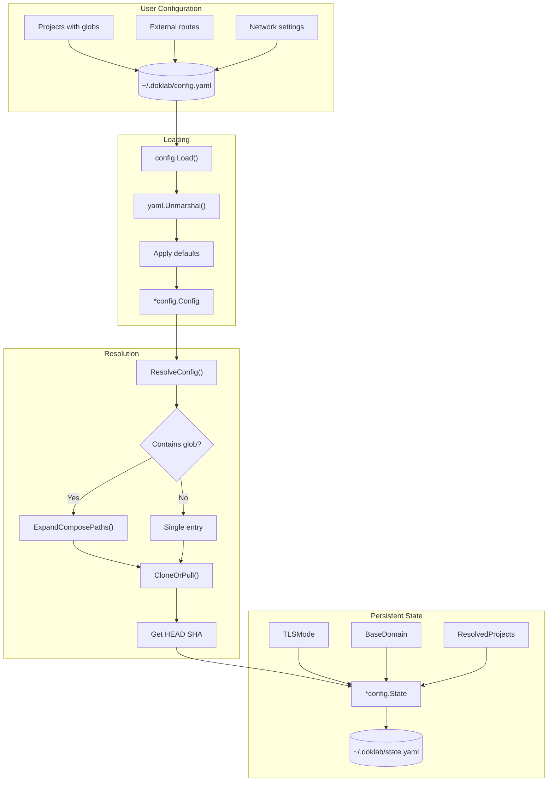

# Config Dataflow

The lifecycle of doklab configuration from user-defined YAML through resolution to persistent state.

## Flow Diagram



## Two-Level Configuration

doklab separates user configuration from resolved state:

| Aspect | config.yaml | state.yaml |
|--------|-------------|------------|
| **Glob patterns** | Allowed (`services/*/compose.yml`) | Expanded to concrete paths |
| **Git sources** | URL only | URL + cloned directory + SHA |
| **Purpose** | User intent | Deployment reality |
| **Edited by** | User | doklab only |

## Glob Expansion

When `ComposePath` contains glob characters (`*`, `?`, `[`, `{`), doklab expands them:

```yaml filename="config.yaml"
projects:
  services:
    source: "file:///home/user/projects"
    compose_path: "*/docker-compose.yml"
```

Expands to multiple entries in state:

```yaml filename="state.yaml"
projects:
  services-api:
    source: "file:///home/user/projects"
    compose_path: "api/docker-compose.yml"
  services-web:
    source: "file:///home/user/projects"
    compose_path: "web/docker-compose.yml"
  services-worker:
    source: "file:///home/user/projects"
    compose_path: "worker/docker-compose.yml"
```

Project names are derived from directory structure to prevent collisions.

## State Structure

```go
type State struct {
    TLSMode    string                      // "tailscale" | "cloudflare"
    BaseDomain string                      // e.g., "host.tailnet.ts.net"
    Projects   map[string]*ResolvedProject
}

type ResolvedProject struct {
    Source      string   // Git URL or file:// path
    Branch      string   // Git branch
    ComposePath string   // Resolved path (never a glob)
    Overlays    []string // Overlay files
    LastSHA     string   // Last deployed commit
    Enabled     *bool    // Deployment control
}
```

## Code Coordinates

| Function | File | Purpose |
|----------|------|---------|
| `Load()` | `internal/config/config.go` | Parse config.yaml |
| `LoadDefault()` | `internal/config/config.go` | Load from default path |
| `ResolveConfig()` | `internal/app/resolve.go` | Transform config to state |
| `ExpandComposePaths()` | `internal/app/resolve.go` | Glob expansion |
| `ResolveAndSaveState()` | `internal/app/resolve.go` | Resolve + persist |
| `LoadState()` | `internal/config/state.go` | Read state.yaml |
| `SaveState()` | `internal/config/state.go` | Write state.yaml |
