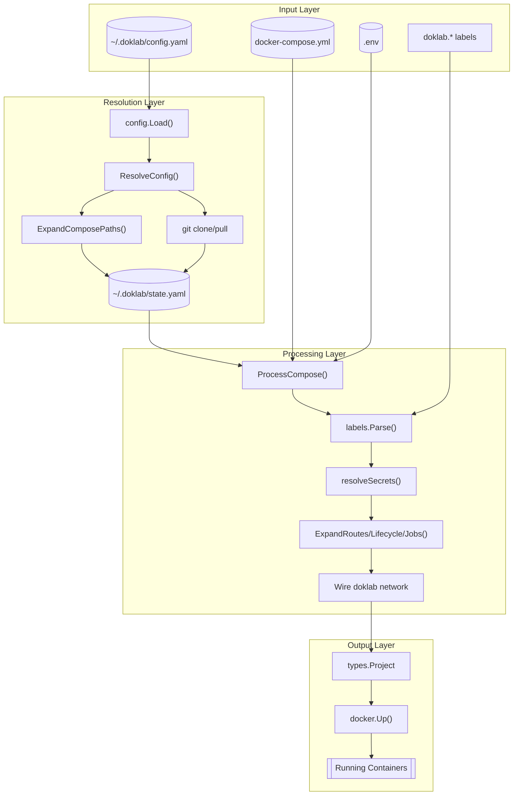

# Project Dataflow

How projects flow from declarative configuration through processing to Docker deployment.

## Flow Diagram



## Stage Details

### 1. Input Layer

The input layer contains user-defined configurations:

| File | Description |
|------|-------------|
| `config.yaml` | Project definitions with source URLs, branches, compose paths (may include globs) |
| `docker-compose.yml` | Standard compose files with doklab-specific labels |
| `.env` | Environment variables, optionally with `ref+` secret references |

### 2. Resolution Layer

The resolution layer transforms abstract configuration into concrete state:

```go
// config.Load() - Parse YAML configuration
cfg, err := config.Load(path)

// ResolveConfig() - Transform config into resolved state
state, err := app.ResolveConfig(cfg)

// ExpandComposePaths() - Expand glob patterns
// "services/*/docker-compose.yml" → ["services/api/docker-compose.yml", ...]

// git clone/pull - Fetch remote repositories to ~/.doklab/repos/
```

The resolved state is persisted to `state.yaml` for subsequent operations.

### 3. Processing Layer

The processing layer transforms compose files with doklab features:

| Function | Purpose |
|----------|---------|
| `ProcessCompose()` | Main orchestration function |
| `labels.Parse()` | Extract `doklab.*` labels into structured data |
| `resolveSecrets()` | Resolve `ref+` references and write secret files |
| `Expand*()` | Convert doklab labels to provider-specific labels |
| Wire network | Add services to `doklab` network for routing |

### 4. Output Layer

The output layer produces running containers:

```go
// types.Project - Fully processed compose project
project := &types.Project{
    Name:     "myapp",
    Services: processedServices,
    Networks: networks,
}

// docker.Up() - Deploy via Docker Compose SDK
err := docker.Up(project)
```

## Code Coordinates

| File | Function |
|------|----------|
| `internal/config/config.go` | Config struct, Load() |
| `internal/config/state.go` | State struct, LoadState(), SaveState() |
| `internal/app/resolve.go` | ResolveConfig(), ExpandComposePaths() |
| `internal/app/compose.go` | ProcessCompose(), processServices() |
| `internal/labels/parse.go` | Parse() |
| `internal/labels/expand.go` | ExpandRoutes(), ExpandLifecycle(), ExpandJobs() |
| `internal/docker/runner.go` | Up(), Down() |

## Example Transformation

**Input** (docker-compose.yml):
```yaml
services:
  api:
    image: myapp:latest
    labels:
      doklab.route.host: api
      doklab.secret.env.API_KEY: ref+sops://secrets.yaml#/api_key
```

**After Processing**:
```yaml
services:
  api:
    image: myapp:latest
    environment:
      - API_KEY=actual-secret-value
    labels:
      traefik.enable: "true"
      traefik.http.routers.api.rule: "Host(`api.example.com`)"
      # ... more traefik labels
      doklab.metadata.managed-by: doklab
      doklab.metadata.project: myapp
    networks:
      - doklab
```
