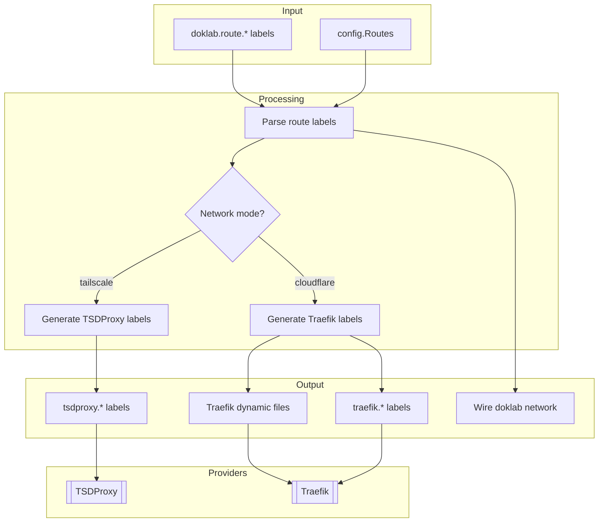

# Routing Dataflow

Route configuration for Tailscale (TSDProxy) and Cloudflare (Traefik) modes.

## Flow Diagram



## Route Types

### Service Routes

Defined via labels on Docker services:

```yaml
labels:
  doklab.route.host: api
  doklab.route.port: "8080"
```

### External Routes

Defined in config.yaml for non-Docker services:

```yaml
routes:
  plex:
    target: http://192.168.1.100:32400
    tls_skip_verify: false
```

## Label Expansion

### Tailscale Mode (TSDProxy)

```yaml
# Input
doklab.route.host: api
doklab.route.port: "8080"

# Output
tsdproxy.enable: "true"
tsdproxy.name: "api"
tsdproxy.port.1: "443/https:8080/http"
```

TSDProxy automatically:
- Registers the service on your Tailnet
- Obtains Tailscale MagicDNS certificates
- Proxies HTTPS traffic to the container

### Cloudflare Mode (Traefik)

```yaml
# Input
doklab.route.host: api
doklab.route.port: "8080"

# Output
traefik.enable: "true"
traefik.http.routers.api.rule: "Host(`api.example.com`)"
traefik.http.routers.api.entrypoints: "websecure"
traefik.http.routers.api.tls: "true"
traefik.http.routers.api.tls.certresolver: "letsencrypt"
traefik.http.services.api.loadbalancer.server.port: "8080"
```

Traefik automatically:
- Creates router rules for the hostname
- Obtains Let's Encrypt certificates via DNS challenge
- Load balances traffic to containers

## Named Routes (Cloudflare Only)

Multiple routes per service using named route syntax:

```yaml
# Input
doklab.route.host: api
doklab.route.port: "8080"
doklab.route.admin.host: admin
doklab.route.admin.port: "9000"

# Output (api route)
traefik.http.routers.api.rule: "Host(`api.example.com`)"
traefik.http.services.api.loadbalancer.server.port: "8080"

# Output (admin route)
traefik.http.routers.api-admin.rule: "Host(`admin.example.com`)"
traefik.http.services.api-admin.loadbalancer.server.port: "9000"
```

## External Route Files

External routes are written to provider config files:

### Tailscale

```yaml filename="~/.doklab/tsdproxy/lists.yaml"
providers:
  plex:
    host: plex
    port: 32400
    target: http://192.168.1.100:32400
```

### Cloudflare

```yaml filename="~/.doklab/traefik/dynamic/plex.doklab.yml"
http:
  routers:
    plex:
      rule: "Host(`plex.example.com`)"
      entryPoints:
        - websecure
      service: plex
      tls:
        certResolver: letsencrypt
  services:
    plex:
      loadBalancer:
        servers:
          - url: "http://192.168.1.100:32400"
        serversTransport: "plex"
  serversTransports:
    plex:
      insecureSkipVerify: true  # When tls_skip_verify is true
```

## Network Wiring

Services with routes are automatically joined to the `doklab` network:

```go
// Check if service has route labels
if hasRouteLabels(service) {
    // Add to doklab network
    service.Networks = append(service.Networks, "doklab")

    // Ensure network exists
    project.Networks["doklab"] = types.NetworkConfig{
        External: types.External{External: true},
    }
}
```

This allows Traefik/TSDProxy to communicate with containers across projects.

## Hostname Resolution

| Type | Example | Result |
|------|---------|--------|
| Relative | `api` | `api.example.com` |
| Absolute | `api.custom.com` | `api.custom.com` |

Hostnames without dots are treated as relative and appended to the base domain.
