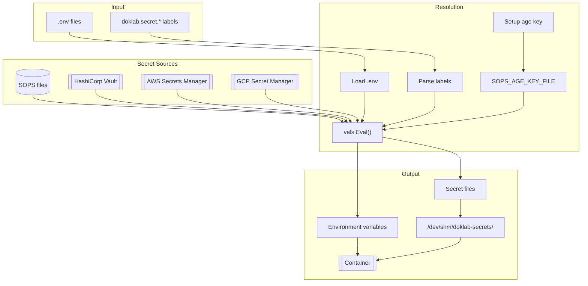

# Secrets Dataflow

Secret resolution from encrypted sources through vals to container injection.

## Flow Diagram



## Secret Types

### Environment Secrets

```yaml
labels:
  doklab.secret.env.DB_PASSWORD: ref+sops://secrets.yaml#/database/password
  doklab.secret.env.API_KEY: ref+vault://vault.example.com:8200/secret/api#/key
```

Resolved to environment variables:

```
DB_PASSWORD=actual-db-password
API_KEY=actual-api-key
```

### File Secrets

```yaml
labels:
  doklab.secret.file.cert: ref+sops://tls.yaml#/cert
  doklab.secret.file.cert.mountPath: /etc/ssl/cert.pem
  doklab.secret.file.cert.decodeFrom: base64
```

Written to filesystem and mounted:

```
/dev/shm/doklab-secrets/myapp/cert → /etc/ssl/cert.pem
```

### .env Secrets

```bash filename=".env"
DB_HOST=postgres
DB_PASSWORD=ref+sops://secrets.yaml#/database/password
```

Resolved inline before passing to Docker Compose.

## Resolution Pipeline

### 1. Age Key Setup

```go
// Check for existing key
ageKey := os.Getenv("SOPS_AGE_KEY")
if ageKey == "" {
    ageKeyFile := os.Getenv("SOPS_AGE_KEY_FILE")
    if ageKeyFile == "" {
        ageKeyFile = filepath.Join(doklabDir, "age.key")
    }
    os.Setenv("SOPS_AGE_KEY_FILE", ageKeyFile)
}
```

### 2. .env Loading

```go
// Load project .env file
env, err := godotenv.Read(envPath)

// Resolve ref+ references
for key, val := range env {
    if strings.HasPrefix(val, "ref+") {
        resolved, _ := vals.Eval(val)
        env[key] = resolved
    }
}
```

### 3. Label Parsing

```go
// Parse secret labels from compose
for name, val := range labels {
    if strings.HasPrefix(name, "doklab.secret.env.") {
        key := strings.TrimPrefix(name, "doklab.secret.env.")
        secrets.Env[key] = val
    }
    if strings.HasPrefix(name, "doklab.secret.file.") {
        // Parse file secret with mountPath and decodeFrom
    }
}
```

### 4. Value Resolution

```go
// Resolve via vals
resolved, err := vals.Eval(reference)
// Handles: ref+sops://, ref+vault://, ref+awssecrets://, etc.
```

### 5. File Writing

```go
// Write to RAM-backed filesystem
secretsDir := "/dev/shm/doklab-secrets/" + projectName
os.MkdirAll(secretsDir, 0700)
os.WriteFile(filepath.Join(secretsDir, name), []byte(value), 0600)
```

### 6. Container Injection

```go
// Add to compose environment
service.Environment = append(service.Environment,
    fmt.Sprintf("%s=%s", key, resolved))

// Mount secret files as volumes
service.Volumes = append(service.Volumes,
    fmt.Sprintf("%s:%s:ro", hostPath, mountPath))
```

## Security Features

### RAM-Based Storage

| Platform | Location |
|----------|----------|
| Linux | `/dev/shm/doklab-secrets/` (tmpfs) |
| macOS | `~/.doklab/secrets/` |

RAM-backed storage ensures secrets never touch disk.

### Automatic Cleanup

Secret files are removed after `docker compose up` completes:

```go
defer os.RemoveAll(secretsDir)
```

### Fresh Resolution

Secrets are resolved fresh on each deployment - no caching of decrypted values.

## Path Resolution

SOPS paths are resolved relative to the project directory:

```yaml
# Project at /home/user/projects/myapp/docker-compose.yml

# Relative path - resolves to /home/user/projects/myapp/secrets.yaml
doklab.secret.env.KEY: ref+sops://secrets.yaml#/key

# Absolute path
doklab.secret.env.KEY: ref+sops:///etc/secrets/global.yaml#/key
```

## Supported Backends

| Backend | Reference Format |
|---------|-----------------|
| SOPS | `ref+sops://file.yaml#/path` |
| Vault | `ref+vault://server/path#/key` |
| AWS | `ref+awssecrets://name#/key` |
| GCP | `ref+gcpsecrets://project/secret` |
| Azure | `ref+azurekeyvault://vault/secret` |

All backends are provided by the [vals](https://github.com/helmfile/vals) library.
