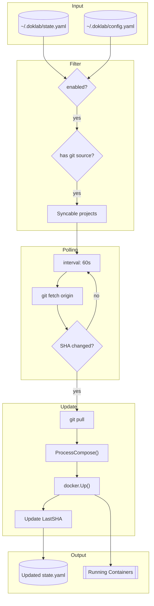

# Sync Dataflow

GitOps synchronization polling and automatic deployments.

## Flow Diagram



## Sync Modes

### 1. Daemon-Based Sync (Recommended)

Runs in background via systemd/launchd:

```bash
# Install and start daemon
doklab daemon install
doklab daemon start
```

Features:
- Continuous polling (default 60s interval)
- Tracks SHA state in state.yaml
- Crash-safe with state persistence
- Automatic recovery

### 2. Manual Foreground Sync

One-time execution:

```bash
doklab sync        # Check all projects
doklab sync myapp  # Check specific project
```

Or start polling in foreground:

```bash
doklab sync start  # Start polling (Ctrl+C to stop)
```

## Syncable Projects

A project is syncable if:

1. **Has git source**: `https://`, `git@`, or `ssh://` (not `file://`)
2. **Is enabled**: `enabled: true` (default)
3. **Exists in state**: Has been resolved and deployed at least once

```go
func isSyncable(project *ResolvedProject) bool {
    if project.Enabled != nil && !*project.Enabled {
        return false
    }
    return strings.HasPrefix(project.Source, "https://") ||
           strings.HasPrefix(project.Source, "git@") ||
           strings.HasPrefix(project.Source, "ssh://")
}
```

## Polling Loop

```go
func SyncLoop(cfg *config.Config, interval time.Duration) {
    ticker := time.NewTicker(interval)
    for range ticker.C {
        state, _ := config.LoadState()
        for name, project := range state.Projects {
            if !isSyncable(project) {
                continue
            }
            if hasNewCommits(project) {
                deployProject(name, project)
            }
        }
    }
}
```

## SHA Handling

doklab tracks the last deployed commit SHA:

```go
func hasNewCommits(project *ResolvedProject) bool {
    // Fetch latest from remote
    git.Fetch(project.Path)

    // Get current HEAD SHA
    currentSHA := git.GetHeadSHA(project.Path)

    // Compare with last deployed
    // Handle both 7-char and 40-char SHAs
    return !shaMatches(project.LastSHA, currentSHA)
}

func shaMatches(a, b string) bool {
    if len(a) < len(b) {
        return strings.HasPrefix(b, a)
    }
    return strings.HasPrefix(a, b)
}
```

## Daemon Configuration

```yaml filename="~/.doklab/config.yaml"
daemon:
  sync:
    enabled: true      # Enable GitOps sync (default: true)
    interval: 60s      # Poll interval (default: 60s)
  backup:
    enabled: false     # Backup verification (default: false)
    interval: 1h       # Verification interval
```

## Service Management

```bash
# Install as system service
doklab daemon install

# Service control
doklab daemon start
doklab daemon stop
doklab daemon status
doklab daemon logs

# Uninstall
doklab daemon uninstall
```

The daemon uses [kardianos/service](https://github.com/kardianos/service) for cross-platform service management:

- **Linux**: systemd unit
- **macOS**: launchd plist
- **Windows**: Windows Service

## State Updates

After successful deployment, state.yaml is updated:

```yaml
projects:
  myapp:
    source: https://github.com/user/myapp
    branch: main
    compose_path: docker-compose.yml
    last_sha: abc123def456  # Updated after each deploy
    enabled: true
```

This ensures:
- No redundant deployments for unchanged commits
- Recovery after crash (resume from last known state)
- Audit trail of deployed versions
